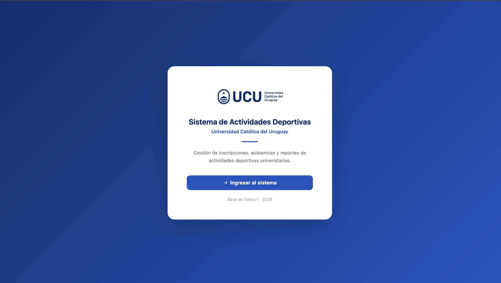
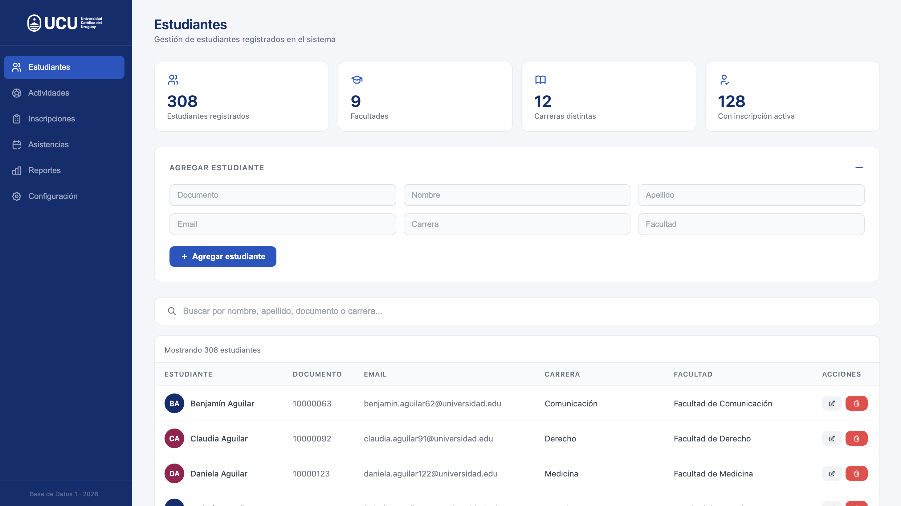
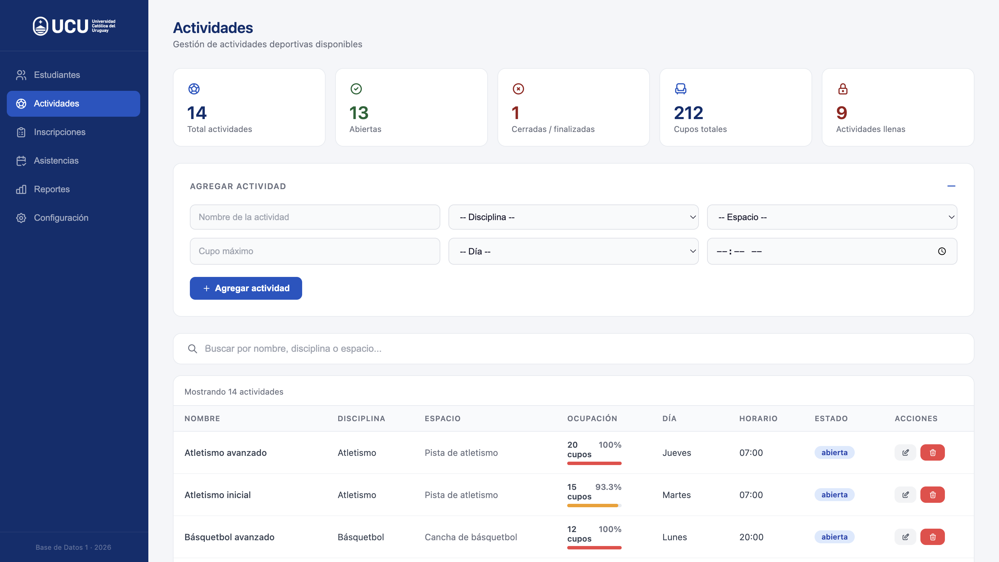
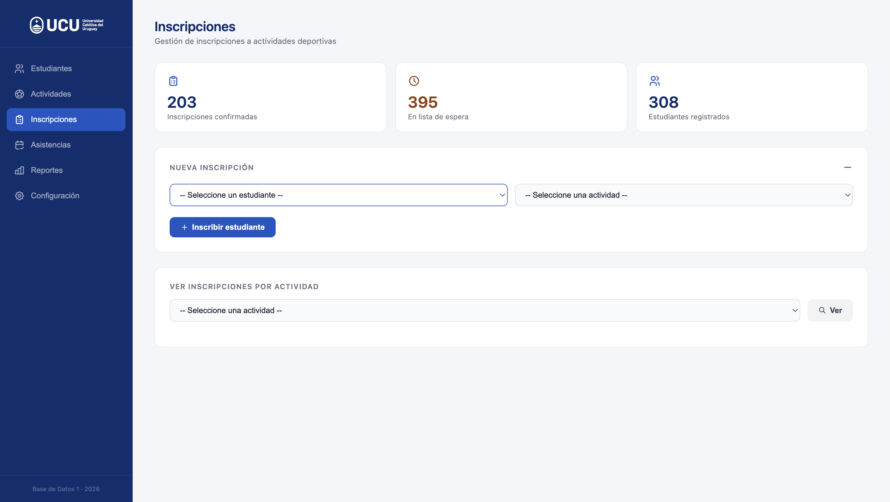
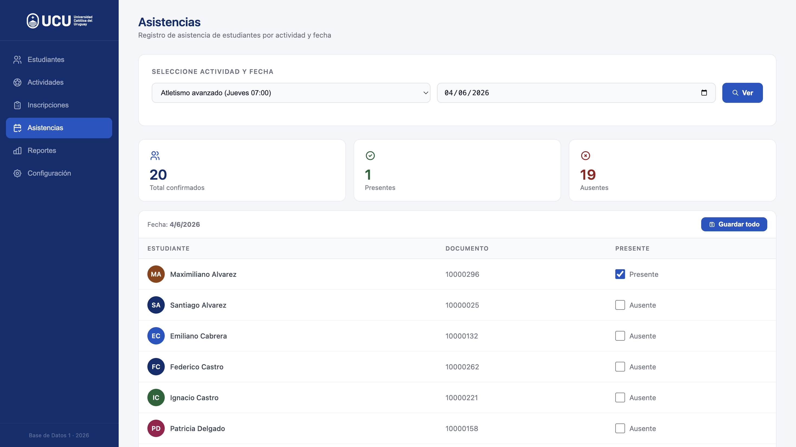
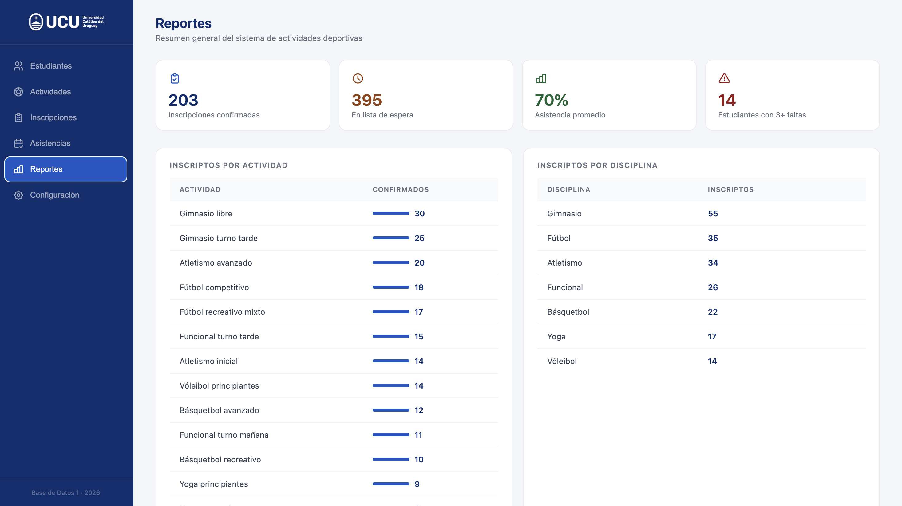
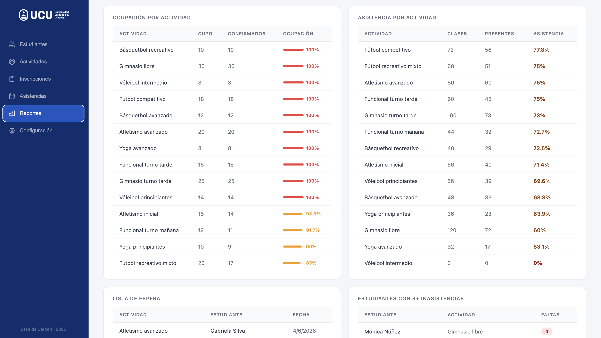
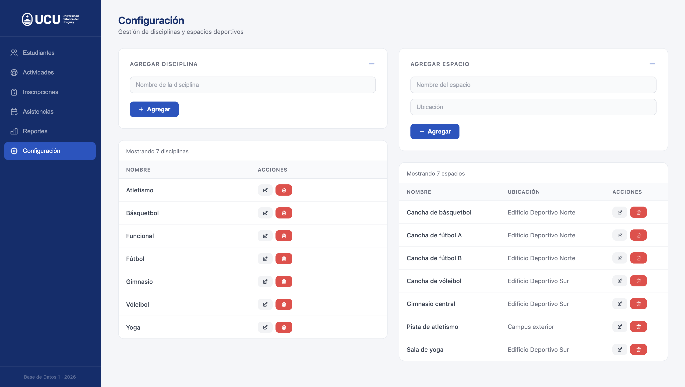

# Sistema de Gestión de Actividades Deportivas

**Universidad Católica del Uruguay - Base de Datos 1 - 2026**

Sistema web para administrar inscripciones de estudiantes a actividades deportivas universitarias. Permite gestionar estudiantes, disciplinas, espacios, actividades, inscripciones, asistencias y consultar reportes.

---
## Vista previa

### Pantalla de bienvenida


Pantalla de acceso al sistema con el logo oficial de la Universidad Católica del Uruguay.

---

### Estudiantes


Gestión completa de estudiantes con estadísticas en tiempo real: total de registrados, facultades, carreras distintas y estudiantes con inscripción activa. Incluye formulario de alta, búsqueda en tiempo real y tabla con avatares identificatorios. Al intentar agregar un estudiante con documento o email ya registrado, el sistema muestra un mensaje de error específico.

---

### Actividades


Gestión de actividades deportivas con barras de ocupación en tiempo real. Cada barra cambia de color según el nivel de ocupación: azul para disponible, naranja para casi lleno y rojo para completo. Las estadísticas superiores muestran el total de actividades, cuántas están abiertas, cerradas y cuántas están llenas.

---

### Inscripciones


Gestión de inscripciones con control automático de cupos. Si hay cupo disponible la inscripción queda confirmada; si no, queda en lista de espera. Al cancelar una inscripción confirmada, el sistema promueve automáticamente al primer estudiante en lista de espera. El sistema impide inscribir dos veces al mismo estudiante en la misma actividad.

---

### Asistencias


Registro de asistencia por actividad y fecha. Solo aparecen los estudiantes con inscripción confirmada. Permite marcar presente o ausente individualmente o guardar todo de una vez. Los contadores de presentes y ausentes se actualizan en tiempo real al tildar cada checkbox.

---

### Reportes - Vista general


Panel de reportes con estadísticas globales del sistema: inscripciones confirmadas, estudiantes en lista de espera, porcentaje de asistencia promedio y cantidad de estudiantes con tres o más inasistencias. Incluye los reportes de inscriptos por actividad e inscriptos por disciplina.

---

### Reportes - Ocupacion y asistencia


Reportes de ocupacion por actividad con barras de progreso y porcentaje, asistencia por actividad con colores segun el nivel, lista de espera completa y estudiantes con tres o mas inasistencias registradas.

---

### Configuracion


Gestion de disciplinas deportivas y espacios fisicos. Permite agregar, editar y eliminar tanto disciplinas como espacios. Si se intenta eliminar una disciplina o espacio que tiene actividades asociadas, el sistema muestra un mensaje de error y no permite la operacion.

---

## Tecnologías

- **Backend:** Python + Flask (sin ORM)
- **Base de datos:** MySQL 8.0
- **Frontend:** HTML + CSS + JavaScript
- **Contenedores:** Docker + docker-compose + nginx

---

## Cómo correr el proyecto

### Opción A - Con Docker (recomendado)

**Requisitos:** tener Docker Desktop instalado.

```bash
git clone https://github.com/Agustina-Esquibel/sistema-actividades-deportivas.git
cd sistema-actividades-deportivas
docker-compose up --build
```

Abrir el navegador en **http://localhost**

La base de datos se crea automáticamente con datos de prueba.

---

### Opción B - Sin Docker (desarrollo local)

**Requisitos:** Python 3.11+, MySQL 8.0

**1. Clonar el repositorio**

```bash
git clone https://github.com/Agustina-Esquibel/sistema-actividades-deportivas.git
cd sistema-actividades-deportivas
```

**2. Crear la base de datos**

Abrir MySQL o DataGrip y ejecutar el script `init/bd_activididades_deportivas.sql`

**3. Configurar variables de entorno**

Crear un archivo `.env` en la raíz del proyecto con el siguiente contenido:
```
DB_HOST=localhost
DB_USER=root
DB_PASSWORD=tu_password
DB_NAME=actividades_deportivas
```
**4. Instalar dependencias e iniciar el backend**

```bash
cd backend
pip install -r requirements.txt
python3 app.py
```

**5. Abrir el frontend**

Abrir `frontend/index.html` con Live Server en VS Code.

Verificar que `const API` en `index.html` apunte a `http://127.0.0.1:5000`

---

## Estructura del proyecto
```
sistema-actividades-deportivas/
├── backend/
│   ├── app.py
│   ├── database.py
│   ├── requirements.txt
│   └── routes/
│       ├── estudiantes.py
│       ├── actividades.py
│       ├── inscripciones.py
│       ├── asistencias.py
│       ├── disciplinas.py
│       ├── espacios.py
│       └── reportes.py
├── frontend/
│   ├── index.html
│   ├── css/style.css
│   └── js/
│       ├── estudiantes.js
│       ├── actividades.js
│       ├── inscripciones.js
│       ├── asistencias.js
│       ├── reportes.js
│       └── configuracion.js
├── init/
│   └── bd_activididades_deportivas.sql
├── Dockerfile
├── docker-compose.yml
└── nginx.conf
```
---

## Funcionalidades

- ABM completo de estudiantes, disciplinas, espacios y actividades
- Gestión de inscripciones con lista de espera automática
- Registro de asistencias por actividad y fecha
- 10 reportes con visualizaciones
- Validaciones en base de datos, backend y frontend
- Promoción automática de lista de espera al cancelar inscripción

---

## Reglas de negocio implementadas

1. Solo inscripciones en actividades abiertas
2. Control de cupo máximo
3. Lista de espera automática si no hay cupo
4. Un estudiante no puede inscribirse dos veces a la misma actividad
5. Solo se registra asistencia de inscripciones confirmadas
6. Actividades canceladas o finalizadas no aceptan inscripciones

---

## Decisiones de diseño

- Se utilizó una clave subrogada en todas las tablas para eficiencia en los joins.
- La tabla `asistencia` referencia a `inscripcion` en lugar de a `estudiante` directamente, garantizando que solo estudiantes confirmados puedan tener asistencia registrada.
- El campo `estado` en `actividad` e `inscripcion` se implementó como `ENUM` para restringir los valores válidos a nivel de base de datos.
- La constraint `UNIQUE(id_estudiante, id_actividad)` en `inscripcion` garantiza la regla de negocio 4 a nivel de base de datos, independientemente del backend.
- Las reglas de negocio 1, 2, 3 y 5 se implementaron en el backend ya que requieren lógica que SQL no puede garantizar por sí solo.
- Al cancelar una inscripción confirmada, el sistema promueve automáticamente al primer estudiante en lista de espera.

---

## Consultas adicionales propuestas por el equipo

Además de las 7 consultas requeridas, se implementaron 3 consultas adicionales:

8. **Lista de espera por actividad:** muestra qué estudiantes están esperando un cupo y desde cuándo, útil para gestionar vacantes cuando alguien cancela.
9. **Ranking de estudiantes más activos:** identifica los estudiantes con más actividades confirmadas.
10. **Actividades sin inscriptos confirmados:** detecta actividades que podrían cancelarse por falta de interés.

---

## Datos de prueba

El script SQL incluye datos de prueba realistas:

- 308 estudiantes de distintas carreras y facultades
- 14 actividades deportivas distribuidas en distintos días y horarios
- Inscripciones respetando los cupos máximos de cada actividad
- Asistencias simuladas durante 4 semanas (mayo 2026) con 70% de presencia promedio
