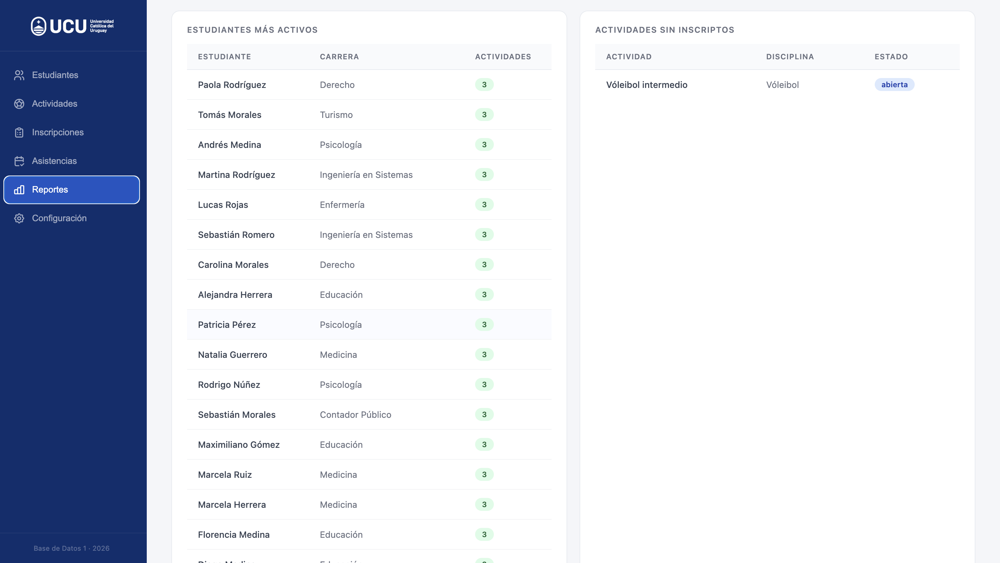
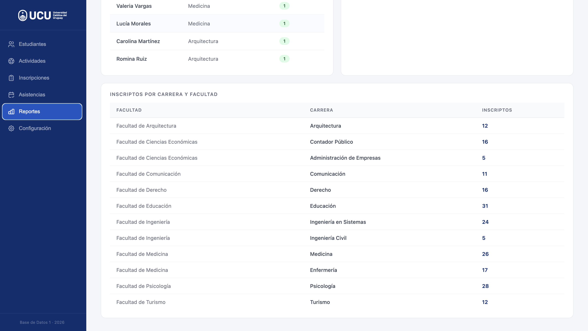

# Sistema de Gestión de Actividades Deportivas

**Universidad Católica del Uruguay - Base de Datos 1 - 2026**

Sistema web para administrar inscripciones de estudiantes a actividades deportivas universitarias. Permite gestionar estudiantes, disciplinas, espacios, actividades, inscripciones, asistencias y consultar reportes.

---
## Vista previa

### Pantalla de bienvenida


Pantalla de acceso al sistema con el logo oficial de la Universidad Católica del Uruguay.

---

### Estudiantes


Gestión completa de estudiantes con estadísticas en tiempo real: total de registrados, facultades, carreras distintas y estudiantes con inscripción activa. Incluye formulario de alta, búsqueda en tiempo real y tabla con avatares identificatorios. Al intentar agregar un estudiante con documento o email ya registrado, el sistema muestra un mensaje de error específico.

---

### Actividades


Gestión de actividades deportivas con barras de ocupación en tiempo real. Cada barra cambia de color según el nivel de ocupación: azul para disponible, naranja para casi lleno y rojo para completo. Las estadísticas superiores muestran el total de actividades, cuántas están abiertas, cerradas y cuántas están llenas.

---

### Inscripciones


Gestión de inscripciones con control automático de cupos. Si hay cupo disponible la inscripción queda confirmada; si no, queda en lista de espera. Al cancelar una inscripción confirmada, el sistema promueve automáticamente al primer estudiante en lista de espera. El sistema impide inscribir dos veces al mismo estudiante en la misma actividad.

---

### Asistencias


Registro de asistencia por actividad y fecha. Solo aparecen los estudiantes con inscripción confirmada. Permite marcar presente o ausente individualmente o guardar todo de una vez. Los contadores de presentes y ausentes se actualizan en tiempo real al tildar cada checkbox.

---

### Reportes

El sistema cuenta con 10 reportes que se actualizan en tiempo real con los datos del sistema.

**Estadísticas generales e inscriptos**


Panel superior con estadísticas globales: inscripciones confirmadas, estudiantes en lista de espera, porcentaje de asistencia promedio y cantidad de estudiantes con tres o más inasistencias. Incluye los reportes de inscriptos por actividad con barras proporcionales e inscriptos por disciplina.

**Ocupación y asistencia por actividad**


Reporte de ocupación de cada actividad con barra de progreso que cambia de color según el nivel: azul para disponible, naranja para casi lleno y rojo para completo. Reporte de asistencia por actividad ordenado de mayor a menor, incluyendo actividades sin registros que aparecen con 0%.

**Estudiantes más activos y actividades sin inscriptos**


Ranking de estudiantes con más actividades confirmadas e identificación de actividades que no tienen ningún inscripto confirmado, útiles para detectar actividades que podrían cancelarse.

**Inscriptos por carrera y facultad**


Distribución de inscriptos por carrera y facultad, permitiendo identificar qué áreas de la universidad tienen mayor participación en las actividades deportivas.

---

### Configuración


Gestión de disciplinas deportivas y espacios físicos. Permite agregar, editar y eliminar tanto disciplinas como espacios. Si se intenta eliminar una disciplina o espacio que tiene actividades asociadas, el sistema muestra un mensaje de error y no permite la operación.

---

## Tecnologías

- **Backend:** Python + Flask (sin ORM)
- **Base de datos:** MySQL 8.0
- **Frontend:** HTML + CSS + JavaScript
- **Contenedores:** Docker + docker-compose + nginx

---

## Cómo correr el proyecto

### Opción A - Con Docker (recomendado)

**Requisitos:** tener Docker Desktop instalado.

```bash
git clone https://github.com/Agustina-Esquibel/sistema-actividades-deportivas.git
cd sistema-actividades-deportivas
docker-compose up --build
```

Abrir el navegador en **http://localhost**

La base de datos se crea automáticamente con datos de prueba.

> **Nota:** con Docker el frontend ya está configurado para comunicarse con el backend a través de nginx en `http://localhost/api`. No es necesario modificar ningún archivo.

---

### Opción B - Sin Docker (desarrollo local)

**Requisitos:** Python 3.11+, MySQL 8.0

**1. Clonar el repositorio**

```bash
git clone https://github.com/Agustina-Esquibel/sistema-actividades-deportivas.git
cd sistema-actividades-deportivas
```

**2. Crear la base de datos**

Abrir MySQL o DataGrip y ejecutar el script `init/bd_activididades_deportivas.sql`

**3. Configurar variables de entorno**

Crear un archivo `.env` en la raíz del proyecto con el siguiente contenido:
```
DB_HOST=localhost
DB_USER=root
DB_PASSWORD=tu_password
DB_NAME=actividades_deportivas
```
**4. Instalar dependencias e iniciar el backend**

```bash
cd backend
pip install -r requirements.txt
python3 app.py
```

**5. Abrir el frontend**

Abrir `frontend/index.html` con Live Server en VS Code.

> **Nota:** para desarrollo local, verificar que `const API` en `index.html` apunte a `http://127.0.0.1:5000` (con Docker apunta a `http://localhost/api` y no hace falta cambiarlo).

---

## Estructura del proyecto
```
sistema-actividades-deportivas/
├── backend/
│   ├── app.py
│   ├── database.py
│   ├── requirements.txt
│   └── routes/
│       ├── estudiantes.py
│       ├── actividades.py
│       ├── inscripciones.py
│       ├── asistencias.py
│       ├── disciplinas.py
│       ├── espacios.py
│       └── reportes.py
├── frontend/
│   ├── index.html
│   ├── css/style.css
│   └── js/
│       ├── estudiantes.js
│       ├── actividades.js
│       ├── inscripciones.js
│       ├── asistencias.js
│       ├── reportes.js
│       └── configuracion.js
├── init/
│   └── bd_activididades_deportivas.sql
├── Dockerfile
├── docker-compose.yml
└── nginx.conf
```
---

## Funcionalidades

- ABM completo de estudiantes, disciplinas, espacios y actividades
- Gestión de inscripciones con lista de espera automática
- Registro de asistencias por actividad y fecha
- 10 reportes con visualizaciones
- Validaciones en base de datos, backend y frontend
- Promoción automática de lista de espera al cancelar inscripción

---

## Reglas de negocio implementadas

1. Solo inscripciones en actividades abiertas
2. Control de cupo máximo
3. Lista de espera automática si no hay cupo
4. Un estudiante no puede inscribirse dos veces a la misma actividad
5. Solo se registra asistencia de inscripciones confirmadas
6. Actividades canceladas o finalizadas no aceptan inscripciones

---

## Decisiones de diseño

- **Claves subrogadas en todas las tablas:** se utilizó un `id` autoincremental como clave primaria en lugar de claves naturales (como el documento del estudiante), para mayor eficiencia en los joins y para evitar problemas si los datos naturales cambian.

- **`asistencia` referencia a `inscripcion` y no a `estudiante`:** esta decisión garantiza a nivel de base de datos que solo estudiantes con inscripción confirmada puedan tener asistencia registrada. Si `asistencia` apuntara directamente a `estudiante`, sería posible registrar asistencia de alguien que nunca se inscribió.

- **`estado` como ENUM:** los campos `estado` en `actividad` e `inscripcion` se implementaron como `ENUM` para restringir los valores válidos directamente en la base de datos, sin depender únicamente de validaciones en el backend.

- **Constraint `UNIQUE(id_estudiante, id_actividad)` en `inscripcion`:** garantiza la regla de negocio 4 a nivel de base de datos. Incluso si el backend fallara o se accediera directamente a la base, no sería posible registrar dos inscripciones del mismo estudiante a la misma actividad.

- **Validación en tres capas:** las reglas de negocio se validan en la base de datos (constraints), en el backend (Python) y en el frontend (JavaScript). Esto garantiza integridad independientemente del punto de acceso al sistema.

- **Promoción automática de lista de espera:** al cancelar una inscripción confirmada, el sistema promueve automáticamente al primer estudiante en lista de espera ordenado por fecha de inscripción, respetando el orden de llegada.

---

## Consultas adicionales propuestas

Además de las 7 consultas requeridas, se implementaron 3 consultas adicionales que aportan valor operativo al sistema:

8. **Lista de espera por actividad:** muestra qué estudiantes están esperando un cupo en cada actividad y desde qué fecha se inscribieron, ordenados cronológicamente. Es útil para que los administradores gestionen las vacantes de forma justa cuando alguien cancela su inscripción.

9. **Ranking de estudiantes más activos:** identifica los estudiantes con mayor cantidad de actividades confirmadas. Permite reconocer a los estudiantes con mayor participación deportiva y detectar posibles casos de sobrecarga de actividades.

10. **Actividades sin inscriptos confirmados:** lista las actividades que no tienen ningún inscripto confirmado, independientemente de su estado. Es una herramienta de gestión para detectar actividades sin demanda que podrían reorganizarse o cancelarse.

---

## Datos de prueba

El script SQL incluye datos de prueba realistas:

- 308 estudiantes de distintas carreras y facultades
- 14 actividades deportivas distribuidas en distintos días y horarios
- Inscripciones respetando los cupos máximos de cada actividad
- Asistencias simuladas durante 4 semanas (mayo 2026) con 70% de presencia promedio
